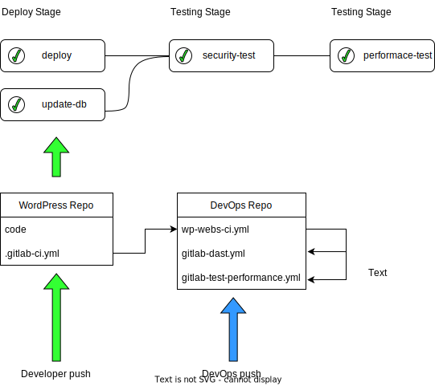

# CI/CD para un Software Shop

Repositorio para gestionar la integracion continua y el despliegue continuo de un Software Shop que produce sitios WordPress (WP).

## Flujo de Trabajo

El desarrollador sube el repositorio de su proyecto WP siguiendo las [instrucciones](webs/README.md) de la carpeta web. En el archivo `.gitlab-ci.yml` de su proyecto el desarrollador puede controlar si se actualiza o no la base de datos con la variable `DEPLOY_DB`. Este archivo incluye los templates que se encuentran en el repositorio de DevOps que es donde se programa el pipeline.

El ingeniero DevOps gestiona los cambios en los pipelines de todos los proyectos desde un repositorio separado al que solo él tiene acceso.
  
## Pipeline

El pipeline cuenta con varias etapas, preparacion, despligue, pruebas de seguridad y pruebas de rendimiento.

**Preparacion:**
- Solo se lanza para desplegar una nueva web
- Tiene un job que lanza el script [deploy_new_web.sh](webs/deploy_new_web.sh)

**Despliegue:**
- Cuenta con dos jobs, uno para desplegar el codigo y otro para desplegar la base de datos (se constrola su lanzamiento con la varibale `DEPLOY_DB`)

**Pruebas de seguridad:**
- Tiene un solo job que utiliza la herramienta OWASP ZAP para lanzar un escaneo de vulnerabilidades sobre la web
- Devuelve el reporte en formato JSON en un artefacto 

**Pruebas de rendimiento:**
- Tiene un solo job basado en el template que propone Gitlab para las pruebas de rendimiento
- TODO configurarlo para que haga crawling de la web y lance el performance test sobre todas las paginas del sitio