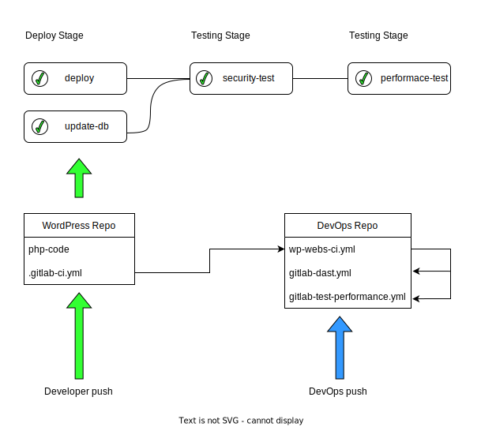

# CI/CD para un Software Shop

Repositorio para gestionar la integracion continua y el despliegue continuo de un Software Shop que produce sitios WordPress (WP).

## Flujo de Trabajo

El desarrollador sube el repositorio de su proyecto WP siguiendo las [instrucciones](webs/README.md) de la carpeta web. En el archivo `.gitlab-ci.yml` de su proyecto el desarrollador puede controlar si se actualiza o no la base de datos con la variable   `DEPLOY_DB`.

  
